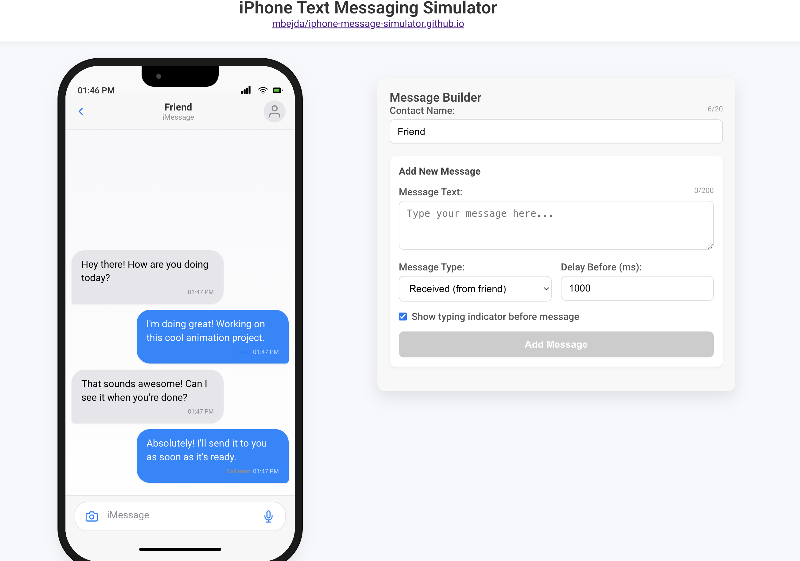

# Iphone Message Simulator 
Frontend application built with that simulates sending and receiving messages on iPhone.
Built with Angular 17.

## ✨ Features
- Send and receive text message animations
- Message flow builder
- Works on all modern browsers

## 🖼️ Screenshot

### 
Questions? Comments? Praise  
Find Me On X [@notMiloBejda](https://x.com/notMiloBejda)

Github Repo: 
[mbejda/iphone-message-simulator](https://github.com/mbejda/iphone-message-simulator)
 
